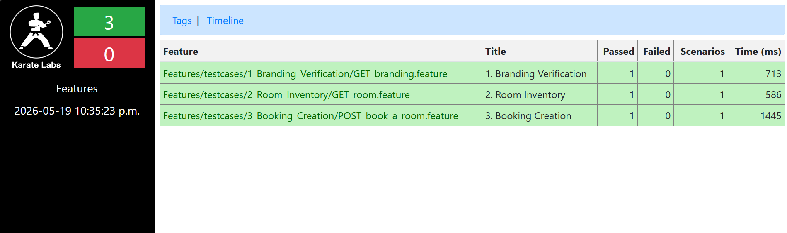
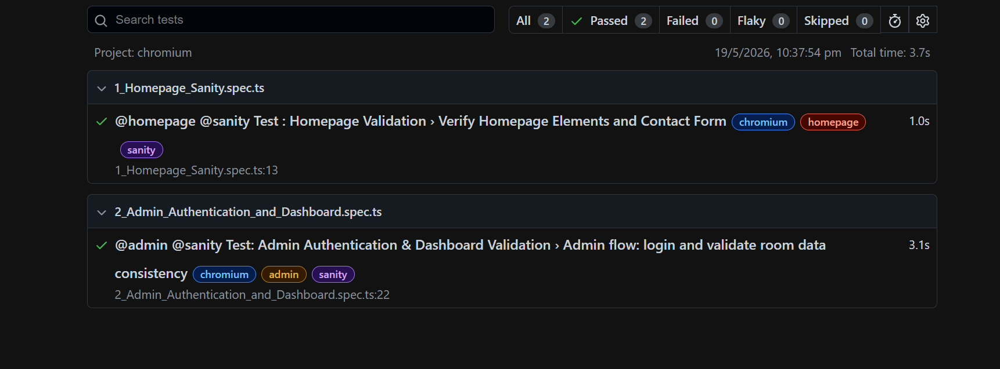
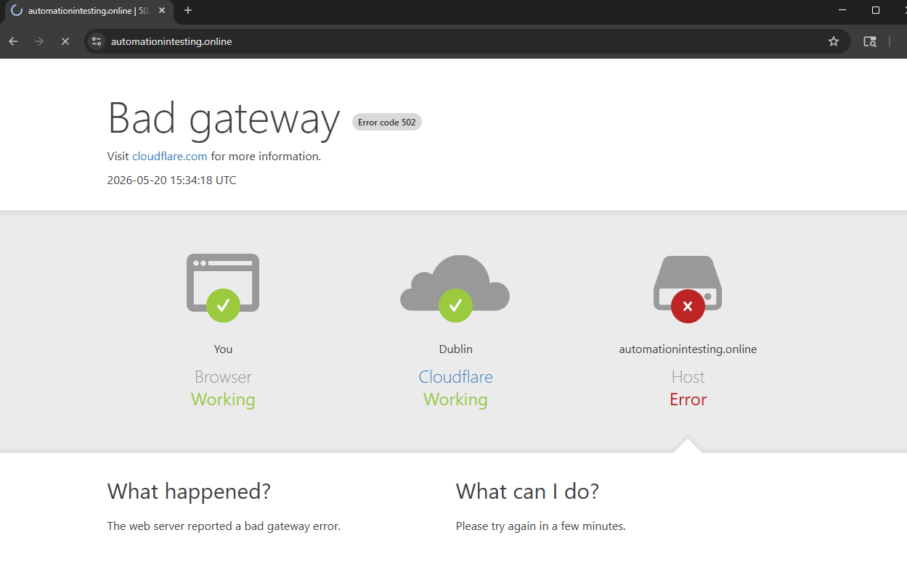

# SDET Technical Challenge: Shady Meadows B&B

## Setup steps
- clone the project: `git clone https://github.com/abiswas2293/shady-meadows-test-suite.git`
- Your runtime environment must have following to ensure smooth running for tests
    -   Java 11+
    -   Maven
    -   Nodejs 20+

## Consideration : Please run the tests only when the website is UP and Running

##### Question 2: UI Automation (Playwright) - As per the requirement there is no form "Contact". So I have automated "Send Us a Message" form instead which contains fields "Name", "Email", "Phone", "Subject", "Message"

## 1. Project Structure and approach
- Project Structure:
  - API tests are implemented using Karate under `api-tests/`.
  - UI tests are implemented using Playwright under `ui-tests/`.

- Approach:
  - The project separates API and UI automation so each suite can be executed and reported independently.
  - Test execution is filtered by tags: Karate uses `@sanity` and Playwright uses `--grep "@sanity"`.

## 2. API Testing (Karate DSL)
- API tests are present in folder: `api-tests\src\test\java\Features\testcases`
- Automated key microservices: /branding, /room, /booking
- Validated response structure using strict matchers (types, regex, numeric checks)
- Used dynamic data handling (e.g., room IDs) to ensure tests remain environment-independent
- Tests were designed to be atomic due to periodic data resets. eg. For the Booking Creation `POST /booking/` scenario, no hard-coded roomid or static dates are used. Instead, a dedicated features/setup module was created to handle test data preparation. This setup flow generates an admin token `POST /auth/login`, creates a new room `POST /room`, and retrieves the latest roomid from the `GET /room` endpoint. As a result, each execution creates a fresh room and performs the booking against it, ensuring test independence and reliability.

## 3. UI Testing (Playwright)
- UI tests are present in folder: `ui-tests\tests`
- Page Object Model Approach
    - The `pages/ folder` contains all page classes representing UI screens.
    - Each `page class` encapsulates:
        - Locators
        - Page-specific actions
        - Reusable methods
    - The `tests/ folder` contains only test scenarios and assertions, keeping them clean and readable.
- Automated critical user journeys on both public and admin portals
- Used resilient locators (getByRole, getByText) to avoid brittle selectors
- Covered:
- Homepage sanity checks (Contact form, room listings, booking buttons)
- Admin login and dashboard validation
- Relied on Playwright auto-waiting for stability in async UI rendering

## 4. Run the project

### Please run the project on Windows Powershell or Linux/MacOS default terminal only (Not on Git bash please)

## For API testing using Karate DSL
- Run API Test
    - Run `mvn clean test -f api-tests/pom.xml "-Dkarate.options=--tags @sanity"`

- View the Karate summary report:
    - macOS: `open api-tests/target/karate-reports/karate-summary.html`
    - Windows: `start api-tests/target/karate-reports/karate-summary.html`   

- Sample Karate API test report :

## For UI testing using Playwright TS
- Install Node modules directly inside the ui-tests subfolder 
   Run `npm install --prefix ui-tests`

- Download the Chromium browser (other browsers are commented out in playwright.config.ts)
    Run `npx --prefix ui-tests playwright install chromium`

- To run the tests (Using Chromium)
    - To run the test in headless mode
    Run `npx --prefix ui-tests playwright test --config=ui-tests/playwright.config.ts --grep "@sanity"`

    - To run the test in headed mode
    Run `npx --prefix ui-tests playwright test --config=ui-tests/playwright.config.ts --grep "@sanity" --headed`

- View the Playwright report:
    - MacOS/Windows powershell: `npx --prefix ui-tests playwright show-report ui-tests/playwright-report`

- Sample Playwright test report :

## 5. CI/CD integration explanation:
- Checkout source code
- Install dependencies (Java, Maven, Nodejs)
- You can also have API and UI automation as separate pipeline jobs or stages.
- I will consider, we have 2 separate pipeline(Smoke, Regression) both running API and UI Tests together in separate stages
    - Pipeline 1 (Smoke): To trigger the tests when a Pull Request is triggered. It will trigger Stage 1 for API tests, if API test fails   only then run Stage 2 for UI tests. This will save time for execution and give results faster. The PR can only be approved when the BUILD is successful.
    - Pipeline 2 (Regression): This can be triggered on scheduled basis (nightly, daily). And we can have 2 separate stages same as above but if Stage 1 fails (API execution), still Stage 2 will be triggered to get complete execution results. The execution report can be attached and send to a recipient via email.
- Publish reports from both jobs (attached to the build):
    - `api-tests/target/karate-reports/`
    - `ui-tests/playwright-report/`

## BUGS

### Server Downtime
- The application environment appears to be unstable at times, with occasional service outages. During these periods, both API and UI tests may fail due to host unavailability rather than application defects.
 

### API Bugs:
- In the `GET /branding` endpoint RESPONSE, the `direction` field contains incorrect data that duplicates the value of the `description` field.
- The `POST /booking/` endpoint allows bookings to be created using non-existent `roomid` values and still returns `201 Created` eg. `invalid roomid = 100, 200, 315`. Invalid room IDs should instead result in a `400 Bad Request` response.

### UI Bugs:
- On the `Homepage`:
    - the room descriptions are not displayed in English.
    - The “Send Us a Message” form displays accessibility/validation-related errors highlighted in red, including issues related to elements such as <input id> and <label for>.
- `Bookings page`:
    - the date picker allows users to select invalid date ranges (e.g., start date: 20/05/2026, end date: 15/05/2026), and bookings can still be completed. In such cases, the booking price is displayed as a negative value.
    - the date picker highlights only the start date and does not visually highlight the selected end date.
    - users can select the same start and end date (e.g., 20/05/2025), resulting in a booking price of 0 pounds.
    - users are unable to modify selected booking dates from the date picker before completing the booking process.
- On the `Admin page`:
    - `Rooms page`, users cannot upload images while creating a room, and newly created rooms do not appear on the Homepage.
    - `Branding page`, branding details cannot be edited.
    - Clicking the `Logout button` successfully logs the user out, but the associated network request returns a 500 Internal Server Error in the background.
    - The admin dashboard occasionally loads slowly.
    - Inbox counts on the dashboard update with noticeable delay.
- Some UI elements become visible before they are fully interactable.

